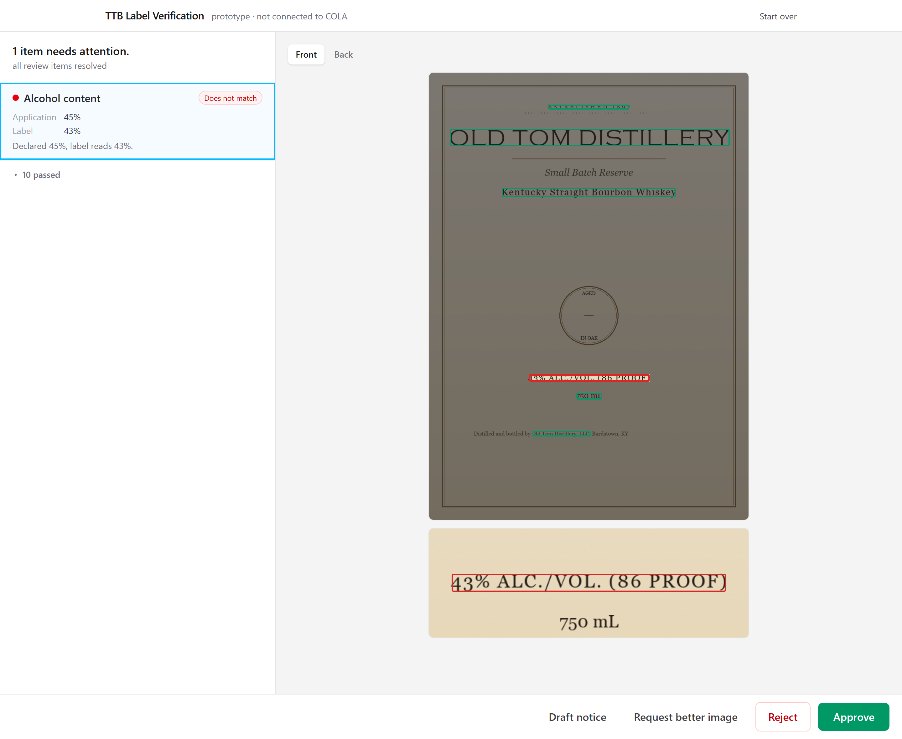
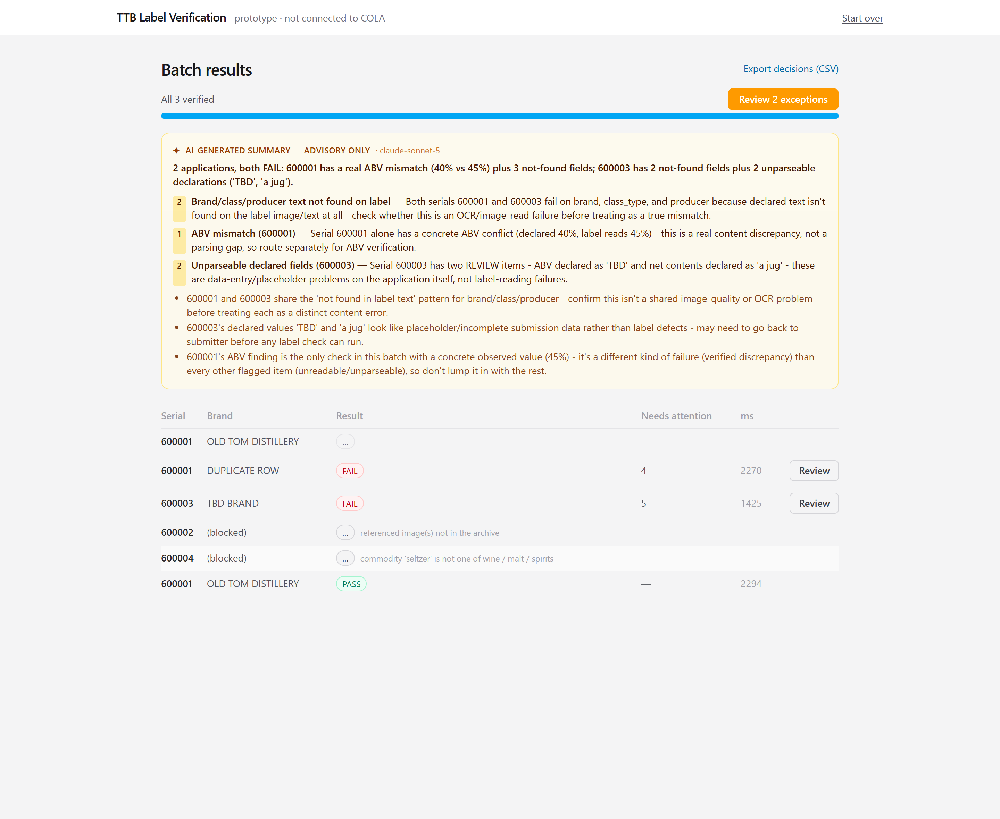
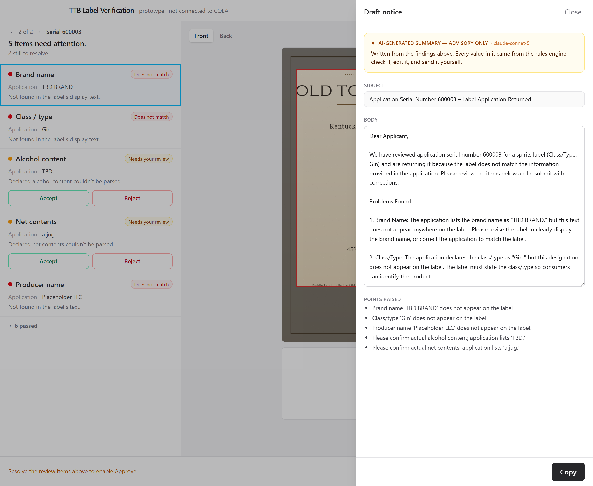
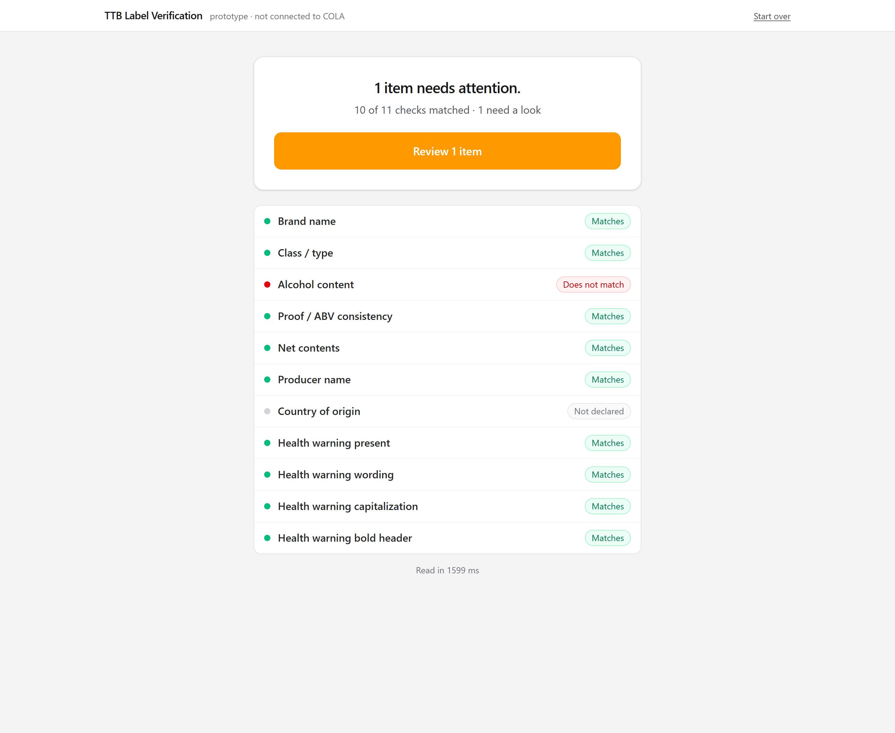
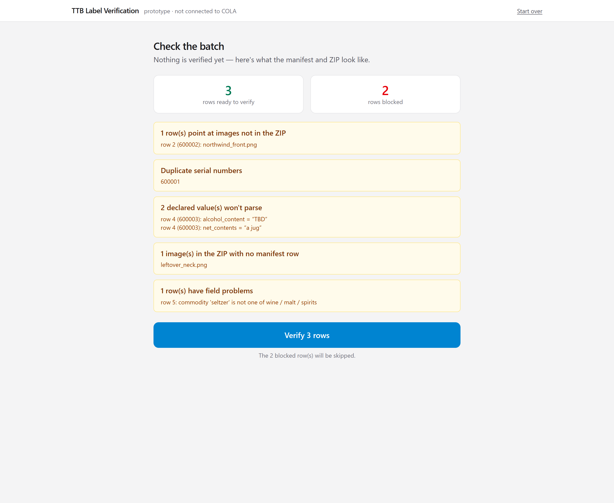

# TTB Label Verification

**[▶ Try it: ttb-verification-app-treasury.onrender.com](https://ttb-verification-app-treasury.onrender.com/)**

An agent uploads a label image and the values declared on the application. The tool reads the
label, compares the two, and returns a per-field verdict with the evidence behind it —
including the exact region of the image each finding came from.

Built for the TTB take-home. Full design record in [`DESIGN.md`](DESIGN.md).

### Three things to try first

1. **Check one label** → use any pair from [`fixtures/images_realistic/`](fixtures/images_realistic).
   `r06_abv_mismatch_front.png` + `_back.png` declare `45% Alc./Vol.` but the label reads 43% —
   the review screen boxes the discrepancy on the image.
2. **Upload a batch** → [`samples/sample_batch_issues.zip`](samples). Pre-flight catches two bad
   manifest rows *before* anything processes; the rest stream in with exceptions sorted to the top.
3. On a flagged batch row, hit **Draft notice** — the rejection letter is written from the
   findings the rules engine already produced.

> It's a prototype: no login, no COLA integration, nothing stored. Sessions live in memory and
> vanish on restart.

---

## Screenshots

**The review screen.** Declared 45%, label reads 43%. The mismatch is boxed in red on the image,
everything that matched is green, and the crop underneath shows the actual print.



**Batch queue.** Exceptions sorted to the top, with an AI-written triage brief *above* the table —
labelled advisory, and never part of the record.



**Drafted rejection notice**, from findings the deterministic engine produced. The agent edits and
sends it; there is no Send button here on purpose.



<details>
<summary>Result screen · batch pre-flight</summary>




</details>

---

## Approach

**The compliance decisions are deterministic; AI is used where it adds something rules can't.**
Three properties matter more than model capability for a regulatory tool: the same label must
produce the same verdict every time, the answer has to arrive in seconds, and a finding has to be
explainable to an auditor. "The wording differs at word 34 — the statute says *machinery*, the
label says *a boat*" is checkable. "The model flagged it" is not.

**Speed comes from doing the cheap thing first.** Local OCR on every label, a network call to a
model only when OCR genuinely failed. p95 is ~600 ms locally against a 5-second budget — the
budget exists because the previous vendor pilot took 30–40 seconds and agents abandoned it.

**Three outcomes, not two.** `PASS` / `FAIL` / **`REVIEW`** / `UNREADABLE` / `NOT_DECLARED`. An
unreadable photo is never a compliance failure, a value the applicant never declared is never a
mismatch, and the governing rule throughout is *never emit `PASS` for a check that wasn't actually
performed*.

**Single label and batch, sharing one pipeline.** One label for the interactive path; a ZIP plus
`manifest.csv` for the 200–300-label submissions that arrive in peak season. Batch validates the
manifest *before* processing anything, then streams results so an agent starts working exceptions
while the tail is still running.

**A review screen that shows the evidence, not just the verdict.** Split pane: checks on the left,
the label on the right with the active field boxed and everything else dimmed, plus a zoomed crop
because small print is the whole problem. Selection is two-way. Each `REVIEW` item gets two large
buttons in the agent's language — *Same product* / *Not a match* — not the machine's.

**AI in three places, none of which decide compliance.** A vision model reads fields OCR couldn't,
capped at `REVIEW`; an LLM writes the batch triage brief; another drafts rejection language. Detail
below.

**Testing that asserts what each check *read*, not just what it decided.** This caught two real
defects that outcome-only tests passed straight over. Detail below.

## Requirements, traced to the interviews

The brief's "Technical Requirements" section is deliberately thin — the real requirements are
buried in the interview transcripts as anecdotes. Each of these is implemented and has a test.

| From the interviews | Requirement | Where it lives |
|---|---|---|
| Dave: *"'STONE'S THROW' on the label but 'Stone's Throw' in the application… obviously the same thing"* | Case/punctuation-tolerant matching | `normalize.py` — a 4-tier ladder, and the tier that fired is shown to the agent |
| Dave: *"You need judgment"* | A third outcome between pass and fail | `REVIEW` + the split-pane review screen |
| Jenny: *"'Government Warning' in title case instead of all caps. Rejected."* | W-3 capitalization check | `warning.py`, and the `warning_titlecase` fixture |
| Jenny: *"has to be exact. Word-for-word"* | W-2 statutory wording, word-level diff | `warning.py` — two-band, because real OCR makes character errors |
| Jenny: *"if an agent can't read the label they just reject it and ask for a better image"* | `UNREADABLE` never collapses into `FAIL`; vision fallback | `models.py`, `ai/vision.py` |
| Jenny: *"photographed at weird angles, or the lighting is bad"* | Deskew / keystone correction before OCR | `preprocess.py` |
| Sarah: *"200, 300 label applications at once"* | Batch upload + streamed results | `service/routes_batch.py` |
| Sarah: *"30, 40 seconds… nobody's going to use it"* | 5 s p95 budget, measured and gated | `report.py`, shown in the UI |
| Sarah: *"something my mother could figure out"* | One primary action per screen, plain-language outcomes | `web/src/screens/` |
| Marcus: *"our firewall blocked connections to their ML endpoints"* | Every model call behind an interface with a working no-network fallback | `ai/client.py` — `NullAi` is the default |
| Marcus: *"don't do anything crazy… we're not storing anything sensitive"* | No persistence at all; in-memory, TTL-swept | `service/sessions.py` |

## Tools used

| | |
|---|---|
| **OCR** | Tesseract 5.x, invoked as a subprocess in **TSV mode** — the default text output discards casing, boxes and confidence, and all three are needed. Chosen over PaddleOCR in a measured bake-off (below) |
| **Backend** | Python 3.12 · FastAPI · uvicorn |
| **Imaging** | Pillow — label rendering, deskew, and the W-4 stroke-weight measurement |
| **AI** | Anthropic `claude-sonnet-5`, via forced tool calls with a JSON schema. Optional: absent a key the app runs without those features |
| **Frontend** | React 18 · Vite · Tailwind v4 · TypeScript |
| **Tests** | pytest — 327 tests, none of which touch the network |
| **Lint** | ruff, config in `pyproject.toml`, gated in CI |
| **Delivery** | One Docker image (frontend + API), GitHub Actions, deployed on Render |

Deliberately **no** third-party fuzzy-matching library: `normalize.py` has a ~30-line normalized
Levenshtein ratio. Dependency-free keeps the no-egress story honest and the unit tests in
milliseconds.

## Assumptions made

Stated because several of these are judgement calls a reviewer should be able to disagree with.

1. **The 5-second budget is per-label interactive latency, not per-batch.** The anecdote describes
   an agent waiting on *one* label. Batch is specified as throughput with streamed results.
2. **The input contract is modelled on the real TTB Form 5100.31** — its field names, and the
   14-digit TTB ID as the key — rather than invented. It costs nothing and grounds the prototype.
3. **Declared fields are optional.** ABV and net contents aren't structured on every COLA record,
   so a missing value is `NOT_DECLARED`, never a mismatch.
4. **ABV is compared exactly; near-misses (≤ 0.5%) go to `REVIEW`.** Per-commodity regulatory
   tolerances exist and are deliberately *not* asserted — a prototype shouldn't claim tolerance
   values it hasn't verified against current regulation.
5. **Batch manifests require a `commodity` column** that the brief's sample manifest omits. The
   canonical schema needs it and there is no safe default.
6. **The health warning reference text is 27 CFR 16.21 verbatim**, treated as exact.
7. **Type-size and characters-per-inch are out of scope** — TTB's own certificate states TTB does
   not review labels for type size; the industry member remains responsible.
8. **No authentication, no persistence, one instance.** In-memory state is what keeps this out of
   the retention and PII conversation; the cost is that it scales vertically, not by replica count.

## Results

Real Tesseract 5.4, no model configured, on a Windows laptop. Gated in CI on every push.

```
false approvals                 0            (gated — must be 0)
expectation mismatches          0            (every check matches checked-in ground truth)
every field reads its own text  PASS         (gated — see Testing)
warning-statement recall        1.0          (every warning defect fixture is caught)
latency  p50 / p95              591 / 606 ms (budget 5000 ms)
review rate                     3.3%         (reported, not gated; 9.9% before W-4 auto-confirm)
```

Realistic corpus (styled and photographed labels): p95 **962 ms**, 0 false approvals.
On the deployed instance, a two-image label round-trips in **~1.4 s** including network.

## Future work

In rough priority order, if this went past prototype:

- **Validate against real COLA history.** Every number above is measured on 83 labels this
  repository generates. The honest next step is a back-test against historical COLA submissions
  and their actual agent decisions — that turns "0 false approvals on our corpus" into a claim
  about the real distribution, and would surface label conventions no synthetic generator invents.
- **Watch agents use it and interview them afterwards**, the same way the brief's own discovery
  sessions were run. The review screen is a hypothesis about what an agent needs; Dave and Jenny
  would find its rough edges in an afternoon. Specifically worth testing: whether the `REVIEW`
  rate feels like help or noise, and whether the AI triage brief actually changes how a supervisor
  works a queue or just gets scrolled past.
- **Persist batches.** Batch state in memory is what forces the single-instance deployment.
  A real store removes that constraint and makes work survive a restart.
- **Expand the rules engine** — standards of identity and fill, appellations, allergen statements.
  Each is a self-contained addition to `rules.py`.
- **Close the remaining OCR gaps** listed under Known Limitations: glare, and warning text on a
  strongly keystoned back label.
- **Authentication and audit logging**, which a real deployment needs and a prototype shouldn't fake.

## Setup

Requires **Python 3.11+** and the **`tesseract`** binary (v5.x).

```bash
python -m venv .venv
.venv\Scripts\activate            # Windows;  source .venv/bin/activate elsewhere
pip install -r requirements-dev.txt
```

Install Tesseract:

| OS | Command |
|----|---------|
| Windows | `winget install UB-Mannheim.TesseractOCR` |
| macOS | `brew install tesseract` |
| Debian/Ubuntu | `sudo apt install tesseract-ocr` |

The code finds the binary on `PATH`, via `TESSERACT_CMD`, or at the standard install
location. With no Tesseract present the pipeline still runs — in a **degraded mode** where
every check is `UNREADABLE` and nothing is auto-approved (N-06).

**Optional — the AI features.** Put a key in `.env` at the repo root:

```
ANTHROPIC_API_KEY=sk-ant-...
```

`.env` is read only by `python -m service`, never by `create_app()`, so the test suite can
never pick up a real key and start making live calls. It is in both `.gitignore` and
`.dockerignore`. In a container the variable comes from the platform instead.

## Run — core + tests

```bash
python -m fixtures.generate           # render the clean 17-label corpus + ground truth
python -m fixtures.realistic          # (re)render the realistic corpus — needs system fonts
python -m fixtures.boldness           # (re)render the W-4 boldness calibration corpus
pytest                                # 327 tests
python report.py                      # accuracy + latency for both corpora; review overlays
```

Verify a single application from the CLI:

```bash
python -m ttbverify --demo brand_mismatch           # a bundled fixture case
python -m ttbverify path/to/application.json        # your own, canonical schema
python -m ttbverify path/to/application.json --json # machine-readable result
```

`application.json` is one object in the canonical schema (design 2.2) — the same shape as
the `"application"` block in `fixtures/cases.json`. Image paths resolve relative to the
JSON file.

## Run — the web app

```bash
# 1. build the frontend once (outputs web/dist, which the API serves)
cd web && npm install && npm run build && cd ..

# 2. start the service
python -m service                     # http://127.0.0.1:8000
```

Or the whole thing in one container, which is what gets deployed:

```bash
docker build -t ttbverify .
docker run --rm -p 8000:80 ttbverify        # http://127.0.0.1:8000
```

It listens on `$PORT`, defaulting to 80, which is what container hosts set — so
there is nothing to configure for it to deploy.

One process serves the API and the built React bundle from the same origin — one URL, no
CORS, nothing to configure. Add `-e ANTHROPIC_API_KEY=...` to enable the AI features.

---

# In depth

## Where the AI is, and where it deliberately isn't

**AI is used in three places, none of which decide compliance:**

| | What it does | Decides a verdict? |
|---|---|---|
| **Vision fallback** | When OCR still can't read a field after preprocessing, a vision model is asked what the label says | **No** — the reading is capped at `REVIEW` |
| **Batch triage brief** | After a batch finishes, one call turns the structured findings into "these 31 exceptions are one importer's rounding error; handle them as a group" | No — the queue table stays the record |
| **Draft rejection language** | On demand, turns findings the rules engine already produced into a notice the agent edits and sends | No — the decision is already made |

**Every regulatory verdict comes from deterministic code.** The normalization ladder, the
statutory warning comparison, the capitalization rule, the boldness measurement and all the
numeric comparisons are ordinary code with ordinary tests. That is what makes a finding
explainable to an auditor by pointing at the exact word that didn't match the statute,
rather than at a model.

### The cap, which is the whole safety argument

**A model-sourced reading can only ever produce `REVIEW`.** Not `PASS`, and not `FAIL`
either. The model's only power is to convert *"I can't read this"* into *"here's what it
appears to say — please confirm."*

Verified against the live API, not just asserted: on a deliberately poor photograph, OCR read
only `RUSTY ANCHOR`, the model read `40% ALC./VOL. (80 PROOF)` and `750 mL` at 0.98
confidence, and **both landed at `REVIEW`** despite matching the declared values exactly.

Three consequences worth stating:

- **"Zero false approvals" stays a property of the deterministic system.** It is gated in CI
  against corpora that can be re-run; a nondeterministic component able to mint a `PASS`
  would move a proven property into the merely-likely column.
- **Network dependence is benign.** With a key: `REVIEW` plus a reading. Without one:
  `UNREADABLE`. Both route to a human; neither approves. Whether Marcus Williams' firewall
  let the call through changes the *evidence*, never the *verdict class*.
- **Nothing is auto-approved on a model's say-so**, which is the property that lets this
  anywhere near a regulatory workflow at all.

### Without an API key

The app runs identically minus those three features. That is a **supported configuration,
not a degraded one** — `NullAi` is the default, and it is what the entire test suite runs on,
which is how "works with no network" (N-06) stays continuously asserted instead of claimed.
No test in this repository opens a socket; the model-backed paths replay recorded cassettes.

---

## Testing

The layers are ordinary — unit, golden, contract, performance — but one of them is the reason
this section exists at all, and it was added late after the outcome-only gates let two real
defects through.

**Where to look:** [`tests/`](tests) · generated labels in [`fixtures/images/`](fixtures/images)
(clean), [`fixtures/images_realistic/`](fixtures/images_realistic) (styled + photographed) and
[`fixtures/images_boldness/`](fixtures/images_boldness) (W-4 calibration). Every label is rendered
by [`fixtures/generate.py`](fixtures/generate.py),
[`realistic.py`](fixtures/realistic.py) and [`boldness.py`](fixtures/boldness.py), with its ground
truth checked in beside it. `python report.py` prints every gate and burns the review-overlay
boxes into `out/overlay_*.png` — the same `CheckResult.box` coordinates the review screen draws.

### Per-field reading — the gate that matters most

Outcome strings alone are a weak test. A verdict can be right for the wrong reason: a check
pointing at another check's line, or a fixture whose brand overflowed the label and was never
OCR'd at all, both still produce the expected `FAIL`. Both of those actually happened here and
the outcome gates said nothing.

So every generated case records, per check, **what the label says and which images it says it
on** (`expect_observed`), and `tests/test_field_reading.py` asserts the pipeline against it —
29 undegraded labels × 7 categories. Three statuses:

| status | meaning |
|---|---|
| `matched` | the observed text matches the label's own text (via the normalization ladder, so OCR noise is tolerated) and came from one of the images that actually print it |
| `only_in_fine_print` | the declared value *is* on the label but buried inside a longer statement — must `FAIL`, and the box points at the buried occurrence so the agent can see the decoy (design 3.2) |
| `not_found` | it isn't on the label. `observed` is `None` — the tool says it didn't find it rather than guessing what the label "probably" says |

Two further guards back this up, and both had to be strengthened after they let something
through:

- **The generators audit their own output.** Every field the ground truth claims is printed
  must be legible on one of its images, or generation fails loudly. The audit asks the same
  question the *check* asks: a display field must be legible as a line of its own, a numeric
  field must be recoverable by its parser. An earlier version asked "is this string anywhere
  on the image", which a brand clipped off the edge of the label passes, because it still
  appears inside the bottler statement — the exact defect the audit was written for.
- **The generators verify their own premise.** A fixture whose fonts silently substituted is
  not the fixture it claims to be. Cases that can't be rendered as described are dropped with
  a printed reason rather than quietly becoming a different test (see the boldness corpus).

### Realistic corpus

The clean corpus above is black text on white — it proves the rules but barely stresses
OCR. `fixtures/realistic.py` renders 16 labels that look like real ones: colour grounds and
gradients, framed borders, Copperplate / Baskerville / slab-serif display faces, a
medallion, a barcode, ABV + net contents in one field of vision, and the government warning
as a small justified block, ruled into a box, or (one case) rotated onto a side panel. Half
the set then gets a *photo of the bottle* pass — rotation, keystone, a lighting vignette,
blur, JPEG compression.

### W-4 boldness calibration corpus

`fixtures/boldness.py` renders 50 matched warning headers — 6 font families × regular/bold ×
two sizes × clean/degraded, plus a heavy-display and a thin-light adversarial — to calibrate
and gate the W-4 auto-confirm.

```
regular headers ever auto-PASSed          0     (the hard gate)
W-4 auto-FAILs                             0     (it only PASSes or REVIEWs)
decidable cases correct                    25/25
decidable auto-decide rate                 48%   (reported, not gated)
```

On a machine without the adversarial faces (any stock Linux box) those two cases are dropped
rather than substituted, and the remaining 48 still calibrate the threshold.

---

## What works

| Capability | Status |
|---|---|
| Brand / class-type matching via the 4-tier normalization ladder | done |
| Display admissibility so a fine-print brand string isn't a false match (design 3.2) | done |
| ABV parsing across label phrasings; proof-vs-ABV (`proof == 2 × ABV`) consistency | done |
| Net contents with unit normalization (mL / cL / L / fl oz / pt) | done |
| Health warning W-1 presence, W-2 wording (two-band), W-3 capitalization | done |
| W-4 boldness — confidence-gated auto-confirm against the statement's own regular text | done |
| Word-level diff of a non-compliant warning statement | done |
| `NOT_DECLARED` (no application value) distinct from `UNREADABLE` (couldn't read it) | done |
| Multi-image applications (front / back) — checks run across all images (F-08) | done |
| Per-stage latency measured and reported (N-03) | done |
| **Deskew / keystone preprocessing** before OCR, applied only when it measurably helps | done |
| **FastAPI service** — `POST /api/verify`, session store, decisions, finalize | done |
| **React UI** — single-label form + result + split-pane review (design 2.5) | done |
| **Batch** — ZIP + `manifest.csv`, pre-flight reconciliation (F-10), streamed queue, per-row review (F-05) | done |
| **Realistic fixture corpus** — colour / serif / borders / boxed & rotated warnings / photos | done |
| **AI: vision fallback, batch brief, drafted notices** — behind one interface, `NullAi` default, cassette-tested | done |
| **Container** — single image, `$PORT`-aware, health-checked, clean SIGTERM shutdown | built and run-tested |
| **CI** — lint, tests, accuracy gates, frontend build, container smoke test | green on GitHub Actions |
| **Deployment** — one always-on container | live |

### API

| Route | Purpose |
|---|---|
| `POST /api/verify` | multipart: declared fields + image(s) → result + session |
| `GET /api/sessions/{id}` | session state (result, decisions, what's unresolved) |
| `POST /api/sessions/{id}/decisions` | record an agent's call on one `REVIEW` item |
| `POST /api/sessions/{id}/draft-notice` | AI: draft rejection language for this label |
| `POST /api/sessions/{id}/finalize` | approve / reject / request better image |
| `POST /api/verify/batch` | ZIP upload → pre-flight report |
| `POST /api/verify/batch/{id}/start` | begin processing |
| `GET /api/verify/batch/{id}/events` | SSE: one event per row + progress + done |
| `GET /api/verify/batch/{id}` | full batch state, including the triage brief |
| `GET/POST /api/verify/batch/{id}/rows/{serial}[/…]` | per-row review + resolve + draft notice |
| `GET /api/verify/batch/{id}/export.csv` | decisions CSV |
| `GET /api/health` | OCR + AI availability, engine, model id, active sessions |

Interactive docs at `/docs`. No persistence: sessions are in-memory and TTL-swept (N-05).

---

## Design decisions worth calling out

**OCR is Tesseract via TSV output, not plain text.** The pipeline needs, per word: original
casing (W-3 capitalization check), a bounding box (review overlay, W-4 crop), and a
confidence score (to tell `UNREADABLE` from `FAIL`). Tesseract's default text output throws
all three away; `tesseract … tsv` keeps them. See the OCR bake-off below.

**A brand match must be a *line*, not a fragment — and the tool never guesses which line.**
A label can legitimately contain the producer's name in fine print that matches the
*declared brand* even when the prominent brand is something else; an unrestricted whole-label
search accepts that and produces a genuine false approval. Two attempts to fix it by *type
size* and by *position* were both wrong, because box height is not type size (a Copperplate
display brand can measure shorter than the class/type line beneath it) and position assumes a
layout. What works is how the match sits in its line: a display match must cover most of its
own line, and not be fine print. `brand_mismatch` and `r05_brand_decoy` exist to hold that
line — each plants the declared brand in the bottler statement while the real display brand
is something else, and both must `FAIL`.

**The warning wording check (W-2) is a two-band comparison, not `==`.** Real OCR makes
character-level errors, so a word-exact match against OCR output produces false rejections
on clean, compliant labels. A token that is *close* to its reference word (similarity ≥
0.75) is treated as probable OCR noise and downgrades the check to `REVIEW`; a token that is
a genuinely different word is a `FAIL` with a word-level diff. Both paths are unit-tested
with deliberately noisy input.

**W-4 (bold header) is confidence-gated, not always-review.** An *absolute* ink-density
threshold is confounded — all-caps text reads denser than mixed-case regardless of weight —
so W-4 instead compares `GOVERNMENT WARNING` against the **regular-weight remainder of the
same statement** (same family, same size, guaranteed present). The estimator is a stroke
thickness (2·area/perimeter, height-normalized, on a 4× upscale so a 1–2 px stroke isn't
lost to quantization). Regular headers land at 1.29–1.46× the body, genuine bold at 1.64×+.
W-4 **auto-PASSes only above 1.55×**; anything short is `REVIEW` with the ratio shown; it
**never auto-FAILs**. A false approval is the expensive error; a false review costs a glance.

**Deskew runs before OCR, and only when it measurably helps.** A hand-held photo is rotated
a degree or two and often turned slightly away from the camera, and Tesseract degrades
sharply on both — on one fixture the brand line is simply absent from the OCR output at 0°
and present after a 4° correction. Candidate corrections are *scored* against doing nothing
using the horizontal projection profile, and applied only when they clearly win: 10 of 31
corpus images get one, every clean render gets none. Boxes are mapped back so everything
downstream still works in the coordinates of the image the agent uploaded.

**Missing declared values are `NOT_DECLARED`, never `FAIL`.** ABV and net contents aren't
structured fields on every COLA record. Asserting a mismatch against a value the applicant
never declared is a false rejection — the error agents won't forgive.

**Governing principle, enforced everywhere:** never emit `PASS` for a check that wasn't
actually performed. OCR unavailable, confidence below floor, field not located → `UNREADABLE`
or `REVIEW`, never a silent pass.

**No third-party fuzzy-matching dependency.** `normalize.py` uses a ~30-line normalized
Levenshtein ratio. Dependency-free keeps the no-egress fallback honest (N-06) and the unit
layer running in milliseconds.

## OCR bake-off: Tesseract vs PaddleOCR

The design asks for a measured choice, not an asserted one.

| | Tesseract 5.x | PaddleOCR |
|---|---|---|
| Word boxes + per-word confidence + original casing | Yes, via `tsv` output | Yes |
| Install footprint | one ~30 MB system package | ~50 Python packages incl. `paddlepaddle` runtime, `pandas`, `opencv` |
| Runtime model download | none — offline out of the box | downloads models from a remote hub on first use; must be pre-baked to satisfy N-06 |
| p95 latency on this corpus | ~600 ms end-to-end | not measured — see below |
| Accuracy on the clean corpus | 100% of gates | expected equal on clean renders |
| Accuracy on skewed / blurred / low-light photos | weaker | stronger — this is Paddle's real advantage |

**Decision: Tesseract.** It passes every gate with ~8× latency headroom and ships offline in
a lean container with no runtime model fetch. Paddle's robustness to skew and blur is real,
but two cheaper things address the same problem here: deterministic deskew, which is ~90 ms
and fixed most of it, and the conditional vision fallback for the residual. The `OcrEngine`
interface (`ttbverify/ocr.py`) is where an alternative engine drops in.

---

## Deployment

One container serves the API and the built frontend from a single origin — one URL for TTB
to open, no CORS, no second service to keep in step.

**Target: Render**, as a single always-on Docker web service. The OCR engine is a system
binary installed with `apt-get`, which rules out a plain serverless function, and the batch
pipeline needs a process that outlives a request.

**It must run as exactly one always-on instance.** That is not incidental — session and
batch state live in memory, which is what satisfies N-05 (no storage of uploaded images or
application data beyond the session) and keeps this prototype out of the retention and PII
conversation entirely. A second replica would mean a batch created on one instance is
invisible to a poll that lands on the other. The price of not having a database is that this
scales by vertical size, not by replica count, which is the right trade for a prototype and
the wrong one for production. A production version would put batch state in a real store,
and that is the point at which the horizontal story changes.

### Why not serverless — a specific finding, not a preference

The first deployment went to Vercel's container-image support and had to be moved. It is
worth writing down what actually failed, because it is a real constraint on this design
rather than a platform complaint:

- **Max duration.** Vercel Functions cap at 300 s by default and 800 s on Pro. A 200–300
  label batch — the requirement, straight out of Sarah Chen's interview (F-05) — runs for
  5–10 minutes on a small instance. It doesn't fit under the ceiling.
- **Batch processing outlives its request.** `POST /verify/batch/{id}/start` returns `202`
  immediately and work continues in a background thread. A function's supported mechanism
  for post-response work is `waitUntil`, which still runs inside the duration budget; a bare
  background thread has no execution guarantee at all.
- **No instance affinity.** Functions scale up under load with no sticky routing, so
  in-memory batch state is per-instance by definition.

Single-label verification is completely fine on that model — one request, sub-second, no
shared state. It is specifically the batch path that needs a server, and that is what made
the choice.

**Azure Container Apps was considered and deliberately not used.** It is the natural fit for
TTB's real infrastructure (Marcus Williams' interview: "we're on Azure now"), and the design
names it for that reason. It isn't used here because deploy-platform choice isn't in the
evaluation criteria, and learning unfamiliar cloud tooling under a time box is a bad trade
against the work that *is* graded. **The container is portable** — the same image runs on
Azure Container Apps, Render or Fly with no code changes, only different platform config.

### Sizing

The batch OCR pool sizes itself to the machine rather than to a constant. `os.cpu_count()`
is the wrong signal in a container — it reports the *host's* cores, so a 1-vCPU instance on a
32-core box claims 32 — so `service/routes_batch.py` reads the cgroup CPU quota instead.
Verified: `--cpus=0.5` and `--cpus=1.0` both give one worker, `--cpus=2.0` gives two.

This was a real bug. The pool was hardcoded to four workers, which on a 1-vCPU instance
means four `tesseract` processes contending for one core and four times the peak memory —
a good way to get OOM-killed part-way through a batch. `TTB_BATCH_WORKERS` overrides the
calculation if a deployment needs tuning without a code change.

At one vCPU, expect roughly 1–2 s per label, so a 300-label batch is 5–10 minutes. N-02's
"2 labels/sec" target needs more cores; it is a throughput claim about the pipeline, not
about the smallest instance it will run on.

### Known trade-offs, stated rather than discovered

- **No authentication.** This is a standalone prototype with no COLA integration, no accounts
  and no persistence, exactly as scoped. Anyone with the URL can use it — including the AI
  features, which cost money. The deployed instance therefore runs on a capped, disposable
  API key that is revoked once the review window closes.
- **One instance means one point of failure.** A restart drops in-flight batches and every
  session, by design (N-05). Re-upload and re-run is the recovery, which is acceptable for a
  prototype and would not be for production.
- **Cold start on a free tier.** Render's free instances spin down when idle, which
  reintroduces exactly the scale-to-zero problem described above; the deployment uses a paid
  always-on instance instead.

## Known limitations

Stated rather than hidden — all of these are live behaviour today.

- **`r14_wine_angle`'s warning wording FAILs.** Deskew recovers the brand on that keystoned
  photo, but OCR still truncates words mid-way through the warning block on the back label.
  It is a compliant label going to a human, not a false approval.
- **`r12_lowlight`'s producer line FAILs.** Blur plus a heavy vignette, not geometry, so
  deskew doesn't help. The vision fallback deliberately doesn't fire here either: it triggers
  only on `UNREADABLE`, never on a `FAIL`, because asking on a `FAIL` would let a model
  *downgrade a rejection to review* — the same power the cap exists to withhold, arriving
  through the back door.
- **W-4 auto-confirms only the confidently-bold case**; everything else is human review, and
  it never auto-FAILs. ~48% of clean same-family headers auto-decide.
- **ABV is compared exactly**, near-misses (≤ 0.5%) routed to `REVIEW`. Per-commodity
  regulatory tolerances exist and are deliberately **not** asserted — a prototype shouldn't
  claim tolerance values it hasn't verified against current regulation.
- **The committed AI cassettes are hand-authored**, not recorded, because the repository was
  built without an API key. Each one says so in a `note` field, and
  `python scripts/record_cassettes.py --record` replaces them with real recordings. What they
  test is unaffected — the request fingerprint, schema validation, the cap, attribution and
  every degradation path are real — but they are not evidence about what the model returns.
- **Fixture corpora are platform-dependent.** The generators use system fonts, so a corpus
  rendered on Linux differs from one rendered on Windows. Both audit clean and pass every
  gate; the images themselves just aren't byte-identical across machines.
- **Not a complete TTB rules engine** — this checks declared-vs-label consistency plus the
  health warning. Standards of identity/fill, appellations, allergen statements, and
  type-size measurement are out of scope (and TTB does not review type size itself).

## Layout

```
ttbverify/
  models.py       canonical types + the Outcome enum
  normalize.py    the 4-tier normalization ladder + hand-rolled Levenshtein
  parsers.py      ABV/proof and net-contents parsing with unit conversion
  preprocess.py   deskew / keystone correction, scored before it is applied
  ocr.py          OcrEngine interface; TesseractOcr (TSV) and NullOcr
  warning.py      health-warning checks W-1..W-4 + the 27 CFR 16.21 reference text
  rules.py        the field engine (display admissibility lives here)
  pipeline.py     verify() / verify_batch(), per-stage timing, the REVIEW cap
  cli.py          python -m ttbverify
  ai/
    client.py     the one place this project talks to a model: schema-validated
                  tool calls, timeout, pinned model, NullAi, cassette replay
    vision.py     use A — read fields OCR could not
    brief.py      use B — the batch triage brief
    notice.py     use C — drafted rejection language
    prompts/      the prompts, as files, in version control
service/
  app.py          FastAPI app: single-label routes, static web/dist, batch router
  sessions.py     in-memory, TTL-swept session store (N-05)
  manifest.py     CSV manifest parse + pre-flight reconciliation
  batch.py        in-memory batch store; queue ordering
  routes_batch.py ZIP upload, /start, SSE /events, per-row review, CSV export
  schemas.py      request/response models
web/
  src/screens/    Home · SingleLabelForm · ResultScreen · ReviewScreen (+ LabelViewer) ·
                  DoneScreen · BatchUpload · BatchPreflight · BatchQueue
  src/components/ AiLabel (attribution) · NoticeDrawer
fixtures/
  generate.py     the clean corpus + ground truth        -> cases.json
  realistic.py    styled + photographed labels           -> cases_realistic.json
  boldness.py     matched bold/not-bold warning headers  -> cases_boldness.json
  cassettes/      recorded model replies + the frozen images they were recorded against
scripts/
  record_cassettes.py  re-record the cassettes against the live API
tests/            unit · per-field reading · golden · realistic · boldness · AI · API · batch
report.py         accuracy + latency for both corpora; renders review-overlay PNGs
Dockerfile        one image: builds the frontend, installs Tesseract, serves both
```
